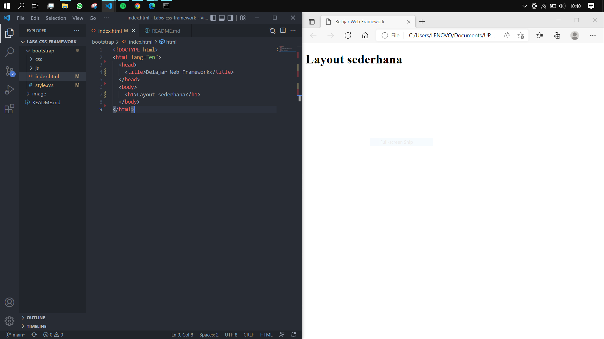

# LAB6 Web Framework

<table border="2" cellpading="10">
  <tr>
    <td><b>Nama</b></td>
    <td>Ilham Nur Utomo</td>
  </tr>
  <tr>
    <td><b>NIM</b></td>
    <td>312010129</td>
  </tr>
  <tr>
    <td><b>Kelas</b></td>
    <td>TI.20.A1</td>
  </tr>
  <tr>
    <td><b>MataKuliah</b></td>
    <td>Pemrograman Web</td>
  </tr>
</table>

# <b>Praktikum</b>

## <b>1. Dokumen awal </b>
 

## <b>2. Bootstrap </b>
- Ada 2 metode, online dan offline. (Disini) saya menggunakan metode offline, download kemudian ekstrak, letakkan di folder yang dituju.
 